# ER Diagram — InterviewIQ AI

## Entity Relationship Overview

All tables use UUID primary keys, soft-delete (`deleted_at`), and audit fields (`created_at`, `updated_at`, `created_by`, `updated_by`).

---

## Entity Relationship Diagram (Mermaid)

```mermaid
erDiagram
    USERS {
        uuid id PK
        varchar email UK
        varchar password_hash
        varchar first_name
        varchar last_name
        varchar phone
        varchar avatar_url
        varchar role
        varchar status
        boolean email_verified
        boolean mfa_enabled
        timestamp last_login_at
        timestamp created_at
        timestamp updated_at
        uuid created_by
        uuid updated_by
        timestamp deleted_at
    }

    REFRESH_TOKENS {
        uuid id PK
        uuid user_id FK
        varchar token UK
        timestamp expires_at
        boolean revoked
        varchar ip_address
        varchar user_agent
        timestamp created_at
    }

    EMAIL_VERIFICATIONS {
        uuid id PK
        uuid user_id FK
        varchar otp_code
        varchar purpose
        timestamp expires_at
        boolean used
        timestamp created_at
    }

    PASSWORD_RESET_TOKENS {
        uuid id PK
        uuid user_id FK
        varchar token UK
        timestamp expires_at
        boolean used
        timestamp created_at
    }

    OAUTH_ACCOUNTS {
        uuid id PK
        uuid user_id FK
        varchar provider
        varchar provider_user_id UK
        varchar access_token
        varchar refresh_token
        timestamp token_expires_at
        timestamp created_at
        timestamp updated_at
    }

    COMPANIES {
        uuid id PK
        varchar name
        varchar slug UK
        varchar logo_url
        varchar website
        varchar industry
        varchar size_range
        text description
        varchar headquarters
        varchar linkedin_url
        varchar status
        timestamp created_at
        timestamp updated_at
        uuid created_by
        timestamp deleted_at
    }

    CANDIDATE_PROFILES {
        uuid id PK
        uuid user_id FK
        varchar headline
        text bio
        varchar location
        varchar linkedin_url
        varchar github_url
        varchar portfolio_url
        int years_of_experience
        varchar current_title
        varchar current_company
        varchar employment_status
        varchar notice_period
        decimal expected_salary_min
        decimal expected_salary_max
        varchar salary_currency
        varchar availability
        boolean open_to_remote
        boolean profile_complete
        int profile_completion_pct
        timestamp created_at
        timestamp updated_at
    }

    RECRUITER_PROFILES {
        uuid id PK
        uuid user_id FK
        uuid company_id FK
        varchar title
        varchar department
        varchar specialization
        text bio
        varchar linkedin_url
        int active_jobs_count
        timestamp created_at
        timestamp updated_at
    }

    SKILLS {
        uuid id PK
        varchar name UK
        varchar category
        varchar normalized_name
        int usage_count
        timestamp created_at
    }

    CANDIDATE_SKILLS {
        uuid id PK
        uuid candidate_id FK
        uuid skill_id FK
        varchar proficiency_level
        int years_experience
        boolean is_primary
        timestamp created_at
    }

    RESUMES {
        uuid id PK
        uuid candidate_id FK
        varchar file_name
        varchar file_url
        varchar file_type
        bigint file_size_bytes
        boolean is_primary
        varchar parse_status
        timestamp parsed_at
        timestamp created_at
        timestamp updated_at
        timestamp deleted_at
    }

    RESUME_ANALYSES {
        uuid id PK
        uuid resume_id FK
        uuid job_id FK
        int ats_score
        int keyword_match_score
        int semantic_match_score
        int format_score
        int experience_score
        jsonb extracted_skills
        jsonb extracted_education
        jsonb extracted_experience
        jsonb missing_skills
        text ai_summary
        text improvement_suggestions
        varchar model_version
        timestamp created_at
    }

    JOBS {
        uuid id PK
        uuid company_id FK
        uuid recruiter_id FK
        varchar title
        varchar slug
        text description
        text requirements
        varchar employment_type
        varchar work_mode
        varchar experience_level
        int min_experience_years
        int max_experience_years
        varchar location
        decimal salary_min
        decimal salary_max
        varchar salary_currency
        varchar status
        timestamp publish_date
        timestamp close_date
        int application_count
        int view_count
        timestamp created_at
        timestamp updated_at
        uuid created_by
        timestamp deleted_at
    }

    JOB_SKILLS {
        uuid id PK
        uuid job_id FK
        uuid skill_id FK
        boolean is_required
        varchar proficiency_level
    }

    APPLICATIONS {
        uuid id PK
        uuid job_id FK
        uuid candidate_id FK
        uuid resume_id FK
        varchar status
        int ats_score
        int ai_rank
        text cover_letter
        text recruiter_notes
        text rejection_reason
        timestamp applied_at
        timestamp status_updated_at
        timestamp created_at
        timestamp updated_at
    }

    INTERVIEWS {
        uuid id PK
        uuid application_id FK
        uuid candidate_id FK
        uuid recruiter_id FK
        uuid job_id FK
        varchar type
        varchar status
        varchar round
        int overall_score
        text ai_feedback
        text ai_summary
        text recruiter_notes
        boolean ai_conducted
        int duration_minutes
        timestamp scheduled_at
        timestamp started_at
        timestamp completed_at
        timestamp created_at
        timestamp updated_at
    }

    INTERVIEW_QUESTIONS {
        uuid id PK
        uuid interview_id FK
        int sequence_number
        varchar question_type
        varchar difficulty
        text question_text
        text expected_answer
        varchar topic
        timestamp created_at
    }

    INTERVIEW_RESPONSES {
        uuid id PK
        uuid interview_id FK
        uuid question_id FK
        text response_text
        int ai_score
        text ai_feedback
        int response_duration_seconds
        timestamp created_at
    }

    ASSESSMENTS {
        uuid id PK
        uuid application_id FK
        uuid job_id FK
        uuid candidate_id FK
        varchar title
        varchar difficulty
        int duration_minutes
        int total_marks
        varchar status
        int score_obtained
        int percentage
        boolean plagiarism_flagged
        decimal plagiarism_score
        timestamp deadline_at
        timestamp started_at
        timestamp submitted_at
        timestamp created_at
        timestamp updated_at
    }

    ASSESSMENT_QUESTIONS {
        uuid id PK
        uuid assessment_id FK
        int sequence_number
        varchar question_type
        varchar difficulty
        text problem_statement
        text constraints
        jsonb test_cases
        jsonb starter_code
        int marks
        varchar topic
        timestamp created_at
    }

    ASSESSMENT_SUBMISSIONS {
        uuid id PK
        uuid assessment_id FK
        uuid question_id FK
        uuid candidate_id FK
        text code
        varchar language
        varchar verdict
        int test_cases_passed
        int total_test_cases
        int execution_time_ms
        int memory_used_kb
        jsonb test_results
        timestamp submitted_at
    }

    NOTIFICATIONS {
        uuid id PK
        uuid user_id FK
        varchar type
        varchar channel
        varchar title
        text message
        jsonb metadata
        boolean is_read
        timestamp read_at
        varchar status
        timestamp created_at
    }

    CALENDAR_EVENTS {
        uuid id PK
        uuid interview_id FK
        uuid organizer_id FK
        varchar title
        text description
        varchar location
        timestamp start_time
        timestamp end_time
        varchar status
        jsonb attendees
        varchar timezone
        varchar meeting_link
        timestamp created_at
        timestamp updated_at
    }

    AUDIT_LOGS {
        uuid id PK
        uuid user_id FK
        varchar action
        varchar entity_type
        uuid entity_id
        jsonb old_value
        jsonb new_value
        varchar ip_address
        varchar user_agent
        timestamp created_at
    }

    LEARNING_ROADMAPS {
        uuid id PK
        uuid candidate_id FK
        uuid job_id FK
        jsonb roadmap_data
        text ai_analysis
        varchar model_version
        timestamp created_at
        timestamp updated_at
    }

    %% Relationships
    USERS ||--o{ REFRESH_TOKENS : "has"
    USERS ||--o{ EMAIL_VERIFICATIONS : "has"
    USERS ||--o{ PASSWORD_RESET_TOKENS : "has"
    USERS ||--o{ OAUTH_ACCOUNTS : "has"
    USERS ||--o| CANDIDATE_PROFILES : "has"
    USERS ||--o| RECRUITER_PROFILES : "has"
    USERS ||--o{ NOTIFICATIONS : "receives"
    USERS ||--o{ AUDIT_LOGS : "generates"

    COMPANIES ||--o{ RECRUITER_PROFILES : "employs"
    COMPANIES ||--o{ JOBS : "posts"

    CANDIDATE_PROFILES ||--o{ CANDIDATE_SKILLS : "has"
    CANDIDATE_PROFILES ||--o{ RESUMES : "uploads"
    CANDIDATE_PROFILES ||--o{ APPLICATIONS : "submits"
    CANDIDATE_PROFILES ||--o{ INTERVIEWS : "participates in"
    CANDIDATE_PROFILES ||--o{ ASSESSMENTS : "takes"
    CANDIDATE_PROFILES ||--o{ LEARNING_ROADMAPS : "has"

    SKILLS ||--o{ CANDIDATE_SKILLS : "tagged in"
    SKILLS ||--o{ JOB_SKILLS : "required by"

    RESUMES ||--o{ RESUME_ANALYSES : "analyzed as"
    RESUMES ||--o{ APPLICATIONS : "used in"

    JOBS ||--o{ JOB_SKILLS : "requires"
    JOBS ||--o{ APPLICATIONS : "receives"
    JOBS ||--o{ INTERVIEWS : "for"
    JOBS ||--o{ ASSESSMENTS : "includes"
    JOBS ||--o{ RESUME_ANALYSES : "scored against"
    JOBS ||--o{ LEARNING_ROADMAPS : "targeted by"

    APPLICATIONS ||--o{ INTERVIEWS : "leads to"
    APPLICATIONS ||--o{ ASSESSMENTS : "includes"

    INTERVIEWS ||--o{ INTERVIEW_QUESTIONS : "contains"
    INTERVIEWS ||--o{ INTERVIEW_RESPONSES : "has"
    INTERVIEWS ||--o{ CALENDAR_EVENTS : "scheduled as"

    ASSESSMENTS ||--o{ ASSESSMENT_QUESTIONS : "contains"
    ASSESSMENTS ||--o{ ASSESSMENT_SUBMISSIONS : "receives"
```



---

## Table Descriptions

### Identity & Auth Tables

| Table | Purpose |
|-------|---------|
| `users` | Core user identity. Single table for all roles (discriminated by `role` column) |
| `refresh_tokens` | JWT refresh tokens with device tracking |
| `email_verifications` | OTP codes for email verification + password reset OTP |
| `password_reset_tokens` | Secure tokens for forgot-password flow |
| `oauth_accounts` | Google OAuth2 linked accounts |

### Business Domain Tables

| Table | Purpose |
|-------|---------|
| `companies` | Company entities that own jobs and recruiters |
| `candidate_profiles` | Extended candidate-specific profile data |
| `recruiter_profiles` | Extended recruiter-specific profile with company association |
| `skills` | Normalized skills dictionary (shared across candidates and jobs) |
| `candidate_skills` | Many-to-many: candidates ↔ skills |
| `resumes` | Uploaded resume files metadata |
| `resume_analyses` | AI-generated ATS scores and extracted data |
| `jobs` | Job postings created by recruiters |
| `job_skills` | Many-to-many: jobs ↔ required skills |
| `applications` | Candidate applications to jobs |

### Interview & Assessment Tables

| Table | Purpose |
|-------|---------|
| `interviews` | Interview sessions (AI or human-conducted) |
| `interview_questions` | AI-generated questions per interview |
| `interview_responses` | Candidate responses with AI scoring |
| `assessments` | Coding assessment assignments |
| `assessment_questions` | Coding problems per assessment |
| `assessment_submissions` | Code submissions with execution results |

### Platform Tables

| Table | Purpose |
|-------|---------|
| `notifications` | All notification records (in-app + email) |
| `calendar_events` | Scheduled interviews and meetings |
| `audit_logs` | Full audit trail for compliance |
| `learning_roadmaps` | AI-generated skill gap and learning plans |

---

## Index Strategy

```sql
-- High-frequency query indexes
CREATE INDEX idx_users_email ON users(email);
CREATE INDEX idx_users_role_status ON users(role, status);
CREATE INDEX idx_applications_job_id ON applications(job_id);
CREATE INDEX idx_applications_candidate_id ON applications(candidate_id);
CREATE INDEX idx_applications_status ON applications(status);
CREATE INDEX idx_jobs_company_status ON jobs(company_id, status);
CREATE INDEX idx_jobs_status_publish ON jobs(status, publish_date DESC);
CREATE INDEX idx_interviews_application ON interviews(application_id);
CREATE INDEX idx_interviews_candidate ON interviews(candidate_id);
CREATE INDEX idx_notifications_user_read ON notifications(user_id, is_read);
CREATE INDEX idx_audit_logs_entity ON audit_logs(entity_type, entity_id);
CREATE INDEX idx_refresh_tokens_token ON refresh_tokens(token);
CREATE INDEX idx_resume_analyses_candidate_job ON resume_analyses(resume_id, job_id);
```
